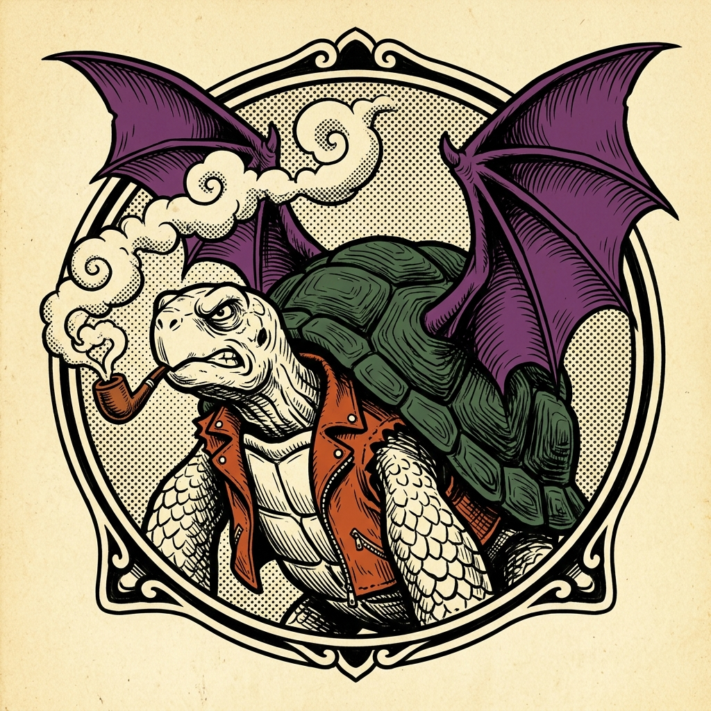

# 🐢 WebDoc — The Midnight Bat-Tortoise
### Guia do Usuário & Manual de Instruções

  

  <strong>Seu Estúdio Visual de Documentos e Publicações no Navegador</strong> 
  <em>Crie textos incríveis, diagrame imagens livremente e exporte em PDF, Word e Imagem com um clique.</em>

---

## 🌟 O que é o WebDoc?

O **WebDoc — The Midnight Bat-Tortoise** é um editor de documentos visual, intuitivo e completo que funciona direto no seu navegador de internet. 

Inspirado na estética marcante dos quadrinhos clássicos e publicações vintage dos anos 70, o WebDoc combina o poder de um processador de textos profissional (como o *Microsoft Word*) com a liberdade de diagramação visual (como o *Canva Docs*).

---

## ✨ O que você pode fazer

| Recurso | O que você ganha |
| :--- | :--- |
| 📄 **Formatos Variados de Folha** | Escolha entre A4, A3, Carta, Ofício ou crie o tamanho personalizado que desejar (em cm, mm ou polegadas). |
| 🔄 **Orientação Instantânea** | Alterne entre modo **Em Pé (Retrato)** e **Deitado (Paisagem)** com um clique. |
| ✍️ **Tipografia & Estilos Ricos** | Fontes clássicas e vintage (*Merriweather*, *Special Elite*, *Bangers*, *Courier*), títulos, listas, tabelas e cores. |
| 🖼️ **Controle Total de Imagens** | Redimensione puxando as pontas da imagem, arraste para qualquer lugar da folha ou insira entre o texto. |
| 🗂️ **Biblioteca de Mídia** | Guarde suas imagens e logotipos em pastas organizadas e insira nos documentos em segundos. |
| 📤 **Exportação em Alta Qualidade** | Baixe seu documento pronto em **PDF**, **DOCX (Word)** ou **Imagem PNG**. |
| 💾 **Salvamento Automático** | Seu trabalho é salvo automaticamente conforme você digita, sem risco de perder nada por acidente. |

---

## 🚀 Como Começar (Passo a Passo)

### 1. Dando um Nome ao seu Documento
No topo superior esquerdo da tela, clique sobre o campo **"Novo Documento"** e digite o título desejado para o seu arquivo.

---

### 2. Escolhendo o Tamanho e a Posição da Folha
No centro do cabeçalho:
* **Seletor de Formato**: Escolha uma folha padrão (ex: `A4`, `A3`, `Carta/Letter`, `Legal/Ofício`).
* **Botão de Orientação 🔄**: Clique no ícone ao lado do seletor para alternar entre **Retrato** (vertical) e **Paisagem** (horizontal).
* **Tamanhos Personalizados**: Selecione a opção *Personalizado* para definir largura e altura exatas na unidade que preferir (`cm`, `mm`, `in` ou `px`).

---

### 3. Escrevendo e Formatando o Texto
A barra superior de ferramentas oferece tudo o que você precisa para dar vida ao seu texto:
* **Títulos e Subtítulos**: Organize seu documento com hierarquia visual clara.
* **Fontes e Tamanhos**: Alterne entre fontes elegantes e modernas ou estilos clássicos de máquina de escrever e quadrinhos.
* **Cores**: Altere a cor das letras ou adicione marca-texto em trechos importantes.
* **Alinhamentos e Listas**: Alinhe à esquerda, centralize, justifique, ou use listas com marcadores e numeração.
* **Tabelas e Citações**: Adicione tabelas personalizadas com linhas/colunas e blocos de citação com visual elegante.

---

### 4. Adicionando Hiperlinks (Links para Sites)
1. Selecione o trecho de texto que deseja transformar em link.
2. Clique no ícone de **Corrente 🔗** na barra de ferramentas.
3. Insira o endereço web (URL, como `https://meusite.com`) e escolha se deseja abrir em uma nova aba.
4. Ao clicar sobre um link criado, você verá um menu rápido para **visitar o site**, **copiar o link** ou **editar**.

---

### 5. Usando a Biblioteca de Mídia
Clique no botão **🗂️ Mídia** no canto superior direito para abrir a gaveta lateral:
* **Criar Pastas**: Crie pastas temáticas (ex: *Logotipos*, *Fotos de Produtos*, *Ilustrações*).
* **Enviar Imagens**: Clique em **Fazer Upload** ou simplesmente **arraste e solte** arquivos do seu computador para dentro da gaveta.
* **Inserir no Documento**: Clique em qualquer imagem da biblioteca para adicioná-la imediatamente à sua página.

---

### 6. Diagramando e Posicionando Imagens
Ao clicar sobre qualquer imagem dentro da folha, você terá controle visual completo:
* **Redimensionar**: Clique e arraste qualquer uma das alças nos 4 cantos da imagem.
* **Mover Livremente (Canvas)**: Ative o modo livre para arrastar a foto para qualquer posição exata da folha.
* **Mover no Fluxo do Texto**: Arraste a imagem para reposicioná-la entre parágrafos de forma fluida.
* **Organizar Camadas**: Use os botões *Trazer para Frente* ou *Enviar para Trás* caso queira sobrepor elementos.
* **Confinamento Automático**: A imagem nunca ultrapassa as bordas da folha, garantindo que nada seja cortado na impressão.

---

### 7. Baixando e Compartilhando seu Documento
Quando seu trabalho estiver pronto, clique em um dos botões coloridos no canto superior direito:

* 📄 **PDF**: Gera um arquivo de impressão perfeito, mantendo todas as fontes, cores e posições milimetricamente idênticas à tela.
* 📝 **DOCX (Word)**: Baixa um documento editável compatível com o Microsoft Word, Google Docs e LibreOffice.
* 🖼️ **PNG**: Exporta a página inteira como uma imagem nítida em alta definição, ideal para apresentações e redes sociais.

---

## ⌨️ Atalhos de Teclado Úteis

| Atalho | Ação |
| :--- | :--- |
| `Ctrl + B` *(ou Cmd + B no Mac)* | Aplicar **Negrito** |
| `Ctrl + I` *(ou Cmd + I no Mac)* | Aplicar *Itálico* |
| `Ctrl + U` *(ou Cmd + U no Mac)* | Aplicar <u>Sublinhado</u> |
| `Ctrl + Z` | Desfazer última alteração |
| `Ctrl + Y` ou `Ctrl + Shift + Z` | Refazer alteração |
| `Ctrl + K` | Inserir ou editar hiperlink |

---

## ❓ Perguntas Frequentes (FAQ)

### 1. O que acontece se eu fechar a aba sem querer?
O WebDoc conta com **salvamento automático contínuo**. Todo o texto e as configurações da página são guardados no seu navegador em tempo real. Ao reabrir o site no mesmo navegador, seu documento estará lá exatamente como você deixou.

### 2. Minhas imagens e textos vão desconfigurar ao exportar para PDF?
Não! O motor de exportação renderiza o documento com precisão visual absoluta, garantindo que o PDF final seja uma cópia idêntica do que você vê na tela.

### 3. Posso usar em qualquer computador?
Sim! O WebDoc roda em navegadores modernos como Google Chrome, Mozilla Firefox, Microsoft Edge, Safari e Opera, sem necessidade de instalar programas pesados.

### 4. Como faço para começar um documento do zero?
Basta selecionar todo o texto do documento (`Ctrl + A`) e pressionar a tecla `Delete` ou `Backspace`. Você também pode alterar o formato da folha a qualquer momento sem perder o conteúdo.

---

  <em>WebDoc — The Midnight Bat-Tortoise • Edição e Composição Visual sem Complicações</em>

